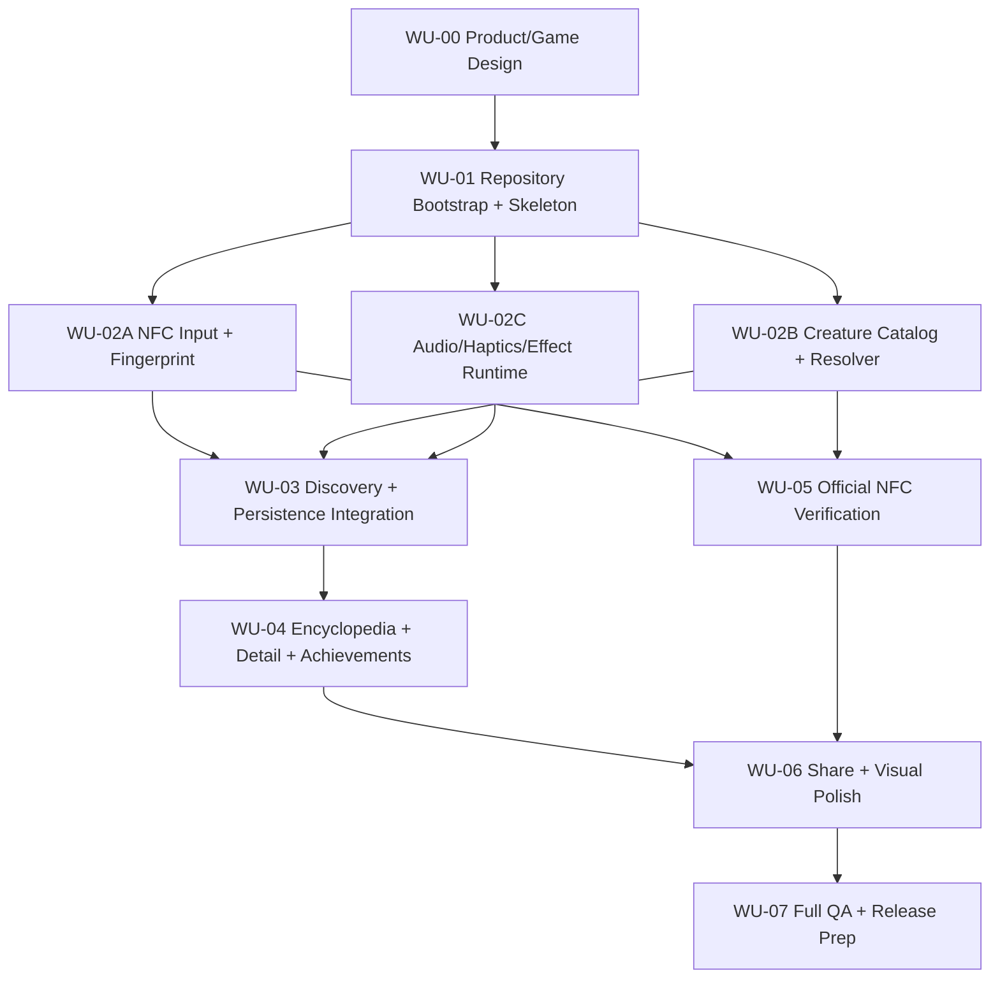

# IMPLEMENTATION_PLAN — NFCDEX

Notion source: [03 IMPLEMENTATION_PLAN — NFCDEX](https://app.notion.com/p/3bd8c2d3ffd081dfa366da2cbbed4e49)

## Strategy

実装は独立したWork Unitに分割する。各WUはObjective、Scope、Do Not Change、Acceptance Criteria、Verificationを持ち、Codexは次WUへ自動進行しない。

## Dependency graph

## WU state

| WU | Name | State |
|---|---|---|
| WU-00 | Product / Game Design | CLOSED / Human Gate PASS — 2026-08-15 |
| WU-01 | Repository Bootstrap + Skeleton | Implemented; Correction Pass complete; exact-SHA review pending |
| WU-02A | NFC Input + Fingerprint | Not started / Not authorized |
| WU-02B | Creature Catalog + Resolver | Not started / Not authorized |
| WU-02C | Audio / Haptics / Effect Runtime | Not started / Not authorized |
| WU-03〜07 | Integration through release | Not started / blocked by dependencies |

## WU-01 — Repository Bootstrap + Skeleton

### Objective

Cold Start可能なPublic repository、最小SwiftUI app、XCTest target、Portable AI Memory / standard Git docsを作る。

### Deliverables

- `NAOKI-Ko/NFCDEX` Public repository、default branch `main`
- SwiftUI skeleton、XCTest target、shared scheme
- `AGENTS.md`
- `docs/START_HERE.md`
- `docs/PROJECT_STATE.md`
- `docs/PRODUCT_SPEC.md`
- `docs/GAME_RULES.md`
- `docs/IMPLEMENTATION_PLAN.md`
- `docs/QA_CHECKLIST.md`
- `docs/CODEX_REPORT.md`
- `docs/REVIEW_LOG.md`
- optional `docs/ai-memory/`補助index
- Build/Test evidence、commit、push、Git整合性確認

### Do not

- NFC機能・game演出を先行実装しない。
- CoreNFC、CreatureResolver、SwiftData、Audio/Haptics、Discovery UI、Official NFC cryptoを実装しない。
- Backend、Supabase、External SDKを追加しない。

### Exit

- Build/Test PASS。
- 必須docs存在・Notion仕様同期・旧project汚染0件。
- commit/push済み。
- local HEAD == origin/main、ahead/behind 0/0、working tree clean。
- ChatGPTがexact remote SHAをreviewする。

## Future WU contracts — reference only

### WU-02A — NFC Input + Fingerprint

実機NFCからhardware identityを取得し、identity v1を確定する。CoreNFC abstraction、scan state、canonicalization、SHA-256 TagFingerprintがscope。Creature UI / SwiftData / official cryptoはscope外。

### WU-02B — Creature Catalog + Resolver

pure domain testsでversioned Resolver v1、rarity config、species/variant resolutionを実装する。既存個体の再現性とbucket boundaryを検証する。

### WU-02C — Audio / Haptics / Effect Runtime

sound player / haptics abstraction、effect profile、preview harnessを実装する。実機qualityはHuman Gate。

Correction Passでは上記WU-02A/B/Cを開始しない。

## Review contract

1. 指定WUだけを実施。
2. Build/Test。
3. UI変更ならVisual QA evidence。
4. implementation commit。
5. PROJECT_STATE / CODEX_REPORT更新。
6. push。
7. local/remote SHA一致、ahead/behind 0/0、clean確認。
8. ChatGPT exact-SHA review。
9. APPROVE後のみ次WUを検討。

## Branching

- Default: `main`
- WU branch: `wu-XX-short-name`
- mainへ勝手にmergeしない。
- force push禁止。
